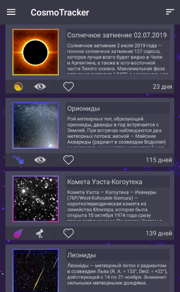
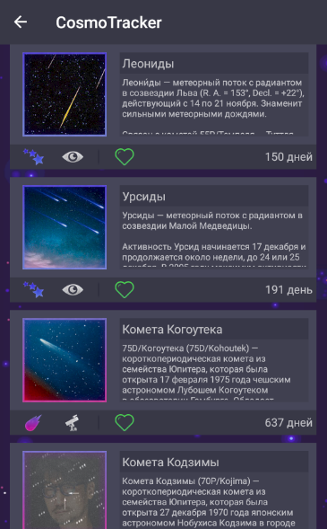
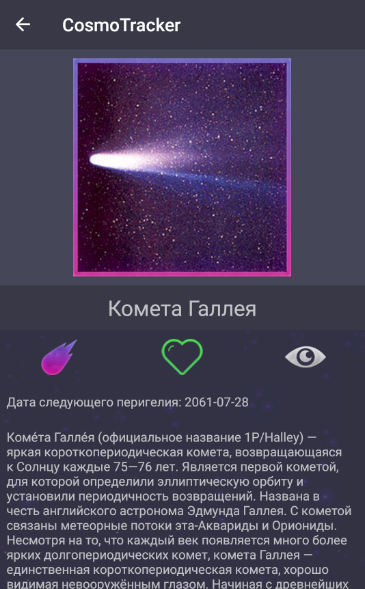

# КосмоТрекер
## Что это такое
КосмоТрекер - приложение на платформу Android в виде библиотеки космических объектов с возможностью подписки на их появление, то есть вы выбираете понравившийся вам космический объект, добавляете в избранное, и, когда объект подойдет к земле достаточно близко, чтобы за ним было комфортно наблюдать, приложение оповестит вас об этом.
### Примеры

### Какие космические объекты есть
* Кометы
* Солнечные затмения
* Планеты
* Метеорные потоки
## Ссылки
Автор - ekostenkodev@gmail.com

[КосмоТрекер в ПлейМаркете](https://play.google.com/store/apps/details?id=com.ekostenkodev.cosmotracker)
